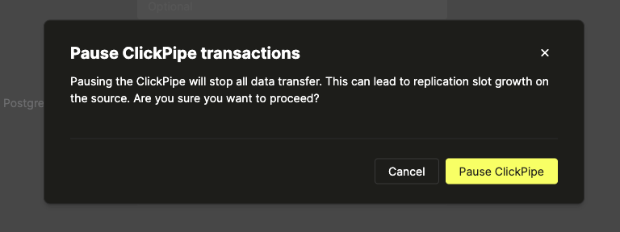
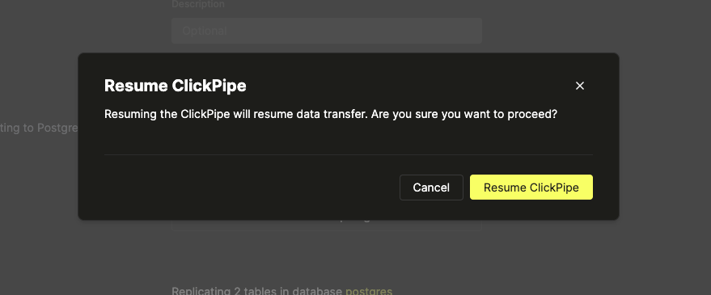

There are scenarios where it would be useful to pause a Postgres ClickPipe. For example, you may want to run some analytics on existing data in a static state. Or, you might be performing upgrades on Postgres. Here is how you can pause and resume a Postgres ClickPipe.

## Steps to pause a Postgres ClickPipe
1. In the Data Sources tab, click on the Postgres ClickPipe you wish to pause.
2. Head over to the **Settings** tab.
3. Click on the **Pause** button.
 
 

4. A dialog box should appear for confirmation. Click on Pause again.
 
 

4. Head over to the **Metrics** tab.
5. In around 5 seconds (and also on page refresh), the status of the pipe should be **Paused**.
 
 

## Steps to resume a Postgres ClickPipe
1. In the Data Sources tab, click on the Postgres ClickPipe you wish to resume. The status of the mirror should be **Paused** initially.
2. Head over to the **Settings** tab.
3. Click on the **Resume** button.
 
 

4. A dialog box should appear for confirmation. Click on Resume again.
 
 

5. Head over to the **Metrics** tab.
6. In around 5 seconds (and also on page refresh), the status of the pipe should be **Running**.
